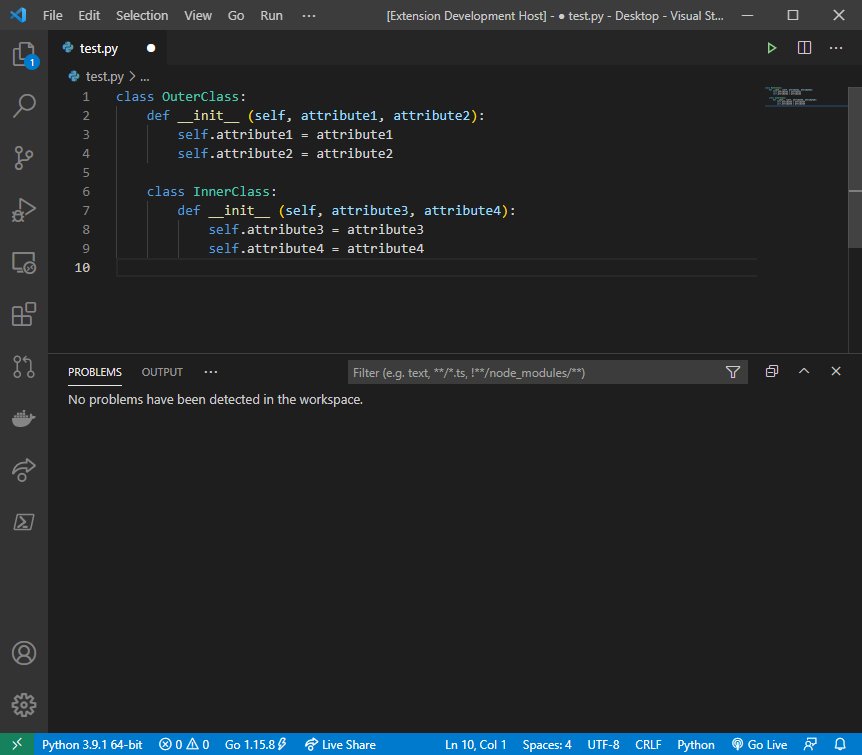

# pyclassgen README

Generate a class including the `__init__` method and attributes for Python

## Features

## Release Notes

Generate a class within a *.py source file

### 0.1.1

Initial release of PyClassGen (Not published to market place)
